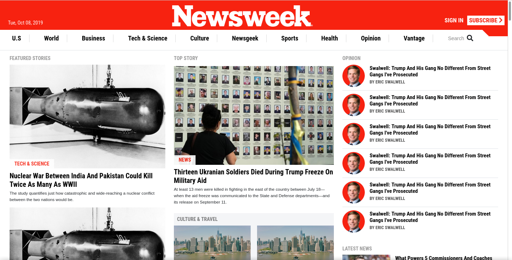

# newsweek-clone

A cloning of the [Newsweek home page](https://www.newsweek.com/) using
Bootstrap. The goal is to use Bootstrap grid layout methods for positioning
the elements on the page and making this latest responsive.



## Featured technologies

- HTML5
- CSS3
- Bootstrap 4

## Setup

1. Clone the repository

```zsh
git clone https://github.com/santiago-rodrig/newsweek-clone
```

2. Change your current directory to that of the cloned repository

```zsh
cd newsweek-clone
```

3. Open `index.html` with your browser

## License

This project is licensed under the [MIT](./LICENSE) license, which
basically means that you can do whatever you want with the code under the
condition of giving credit to its author and noticing the license.

## Contact

You can reach me out at the following URLs

- [github](https://github.com/santiago-rodrig)
- [linkedin](https://www.linkedin.com/in/santiago-andres-rodriguez-marquez)
- [angellist](https://angel.co/u/santiago-andres-rodriguez-marquez)
- [santo1996.29@gmail.com](mailto:santo1996.29@gmail.com)
